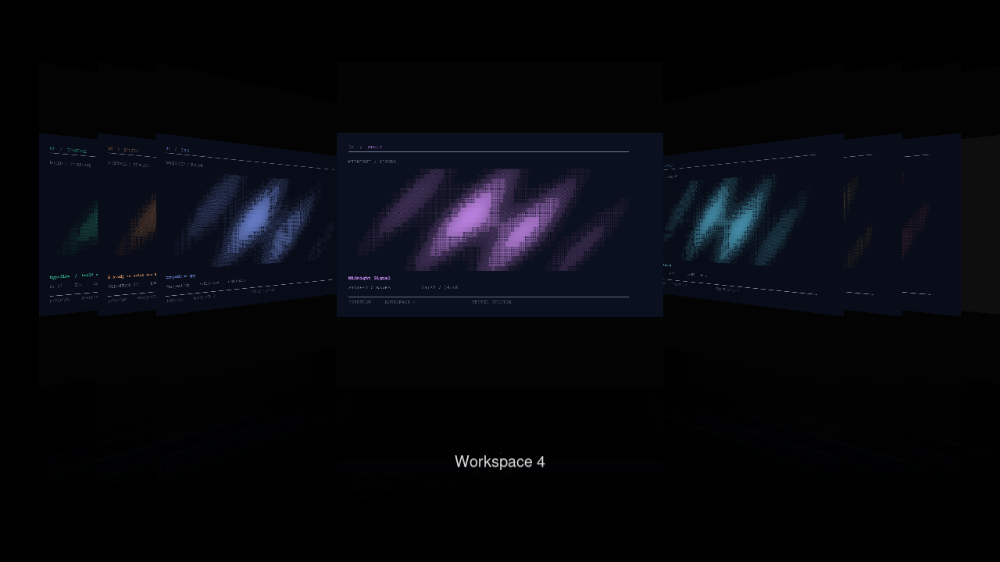

<div align="center">

# Hyprflow

Classic Cover Flow for Hyprland workspaces.

</div>



[Navigation recording](artifacts/final/navigation/navigation.mp4) ·
[Rapid reversal recording](artifacts/final/stress/stress.mp4) ·
[Square calibration](artifacts/final/calibration.png)

Hyprflow turns workspace snapshots into a perspective stack with a front-facing
selection and fading floor reflections. The current desktop contracts into its
card; accepting a workspace expands that card back into the desktop.

The reconstruction follows original iTunes 7 and 7.1 captures. Geometry,
reconstructed timing, and the workspace-specific transitions are documented in
the [animation specification](docs/design-spec.md).

## Install with hyprpm

The supported target is **Hyprland 0.56.2 with the OpenGL renderer**. Install
using Hyprland's plugin manager from a terminal in your Hyprland session:

```sh
hyprpm update
hyprpm add https://github.com/sandwichfarm/hyprflow
hyprpm enable hyprflow
hyprpm reload
```

Hyprpm downloads the source, builds against its matching Hyprland headers, and
manages the installed library. Run it as your normal user. A C++23 compiler,
Make, and the development dependencies are still required; you do not need a
manual clone or a prebuilt binary.

Next, add the [quick-start bindings](docs/getting-started.md#set-up-controls)
to your Hyprland Lua configuration. **Super + Tab** opens the flow;
**Left / Right** browse, **Return** activates, and **Escape** cancels.
The guide also covers startup loading, updating, and removing the plugin.

## Build from source (development)

Build against the headers matching the compositor that will load the plugin.
Hyprland plugins do not have a stable binary ABI. Hyprflow checks the full API
hash at load time and rejects a mismatch.

```sh
pkg-config --modversion hyprland
make -j2
make test
```

The artifact is `build/hyprflow.so`. The build uses C++23, the installed Hyprland
development headers and their dependencies, Lua 5.4, EGL, GLES, and Pango/Cairo.
No libraries are downloaded or vendored. The current target is **Hyprland 0.56.2
with the OpenGL renderer**. Other compositor revisions and the Vulkan renderer
are not qualified.

## Try it in a nested session

Run from an existing Wayland session. The helper creates an isolated compositor
and configuration under `/tmp/hf-*`. This command captures its printed session
directory in `session_dir`:

```sh
session_dir=$(python3 scripts/nested-session.py start | python3 -c 'import json,sys; print(json.load(sys.stdin)["directory"])')
python3 scripts/nested-session.py place "$session_dir"
python3 scripts/nested-session.py fixtures "$session_dir"
python3 scripts/nested-session.py ctl "$session_dir" plugin load "$PWD/build/hyprflow.so"
```

`place` floats, sizes, and pins only the nested compositor’s own window, keeping
frame callbacks available while you switch host workspaces. It records the
previous placement for restoration. Every plugin operation targets the nested
instance explicitly. The daily compositor’s plugin list and configuration remain
unchanged.

In the nested window, press **F10**, then **Left/Right** or **1–7**. Press
**Return** to activate the selection; **Escape** returns to the original workspace.

```sh
python3 scripts/nested-session.py ctl "$session_dir" repl 'return hl.plugin.hyprflow.status()'
python3 scripts/nested-session.py capture "$session_dir" /tmp/hyprflow.png
python3 scripts/nested-session.py stop "$session_dir"
```

Stop restores the owned window’s placement and exits only the recorded compositor
process. Do not rebuild a library while that file is loaded: unload it first,
build, then load the new artifact.

## Configure

[config/hyprflow.lua](config/hyprflow.lua) supplies the default Lua bindings and
the modal `hyprflow` submap. Load the built plugin, then source this file in the
intended Hyprland session. The defaults are:

| Binding | Action |
| --- | --- |
| Super + Tab | Open; toggle reverses entry or closing |
| Super + Alt + Left / Right | Open and move selection |
| Super + Alt + 1–9 | Open and jump to a workspace |
| Left / Right while open | Move selection |
| 1–9 while open | Animate to that workspace |
| Return | Expand and activate selection |
| Escape | Return to original workspace |

Change the bindings freely. The independently assignable Lua actions are
`hl.plugin.hyprflow.toggle()`, `left()`, `right()`, `jump(id_or_name)`, `accept()`,
and `cancel()`. The corresponding dispatchers are `hyprflow:toggle`,
`hyprflow:left`, `hyprflow:right`, `hyprflow:jump`, `hyprflow:accept`, and
`hyprflow:cancel`. With Hyprland’s Lua IPC, invoke an action using `hyprctl eval`,
or retrieve `status()` using `hyprctl repl`.

`plugin.hyprflow.workspace_count` defaults to **9**, with an allowed range of
1–32. It adds numeric cards without creating real workspaces until you accept
one. Existing workspaces on the focused monitor are included, including named
workspaces. Workspaces on other monitors and special workspaces are excluded
from navigation. The active special overlay is included in the original card.

Size, spacing, and borders update while the flow is open. Their defaults preserve
the original appearance:

| Option | Default | Meaning |
| --- | --- | --- |
| `workspace_scale` | `1.0` | Size multiplier, 0.1–2.0; applied to the original `min(0.58 × height, 0.38 × width)` card size |
| `workspace_spread` | `0.18` | Inactive-card spacing in card widths, 0–1; preserves the nearest cover’s position |
| `border_width` | `0` | Inset border width in logical pixels, 0–32; zero disables borders |
| `border_color` | `rgba(ffffffff)` | Default solid color or multicolor gradient |
| `border_color_current` | empty | Override for the workspace active when the flow opened |
| `border_color_focus` | empty | Override for the selected destination; takes precedence over current |

Like Hyprexpo’s modern border settings, one color selects a solid border and
multiple colors select a gradient. There is no ignored legacy `border_style`
switch. See [configuration and examples](docs/configuration.md) for syntax,
inheritance, validation, and test commands.

Selection is separate from activation. A jump travels through intermediate
cards and leaves the flow open. Invalid targets return an error. Navigation
clamps at the ends. The previous submap and client focus are restored on exit.
Keep the supplied submap’s `catchall` binding to consume unrelated keys,
including keys that could otherwise reach an input method.

## Design and verification

The selected cover is square; complete workspace imagery fits inside it without
stretching or cropping. Wide workspaces have black matte padding. Snapshots are
taken on entry and refreshed for the card nearest the center. Far cards are
discarded outside the visible stack to bound texture memory.

The animation uses a continuous focus position, true projective texture mapping,
and a frame-rate-independent critically damped spring. Rapid reversal preserves
velocity. Native workspace activation happens at the end of expansion, with its
ordinary slide animation suppressed.

```sh
make check
make format-check
python3 scripts/capture-proof.py "$session_dir" artifacts/proof --video
python3 scripts/verify-input.py "$session_dir" artifacts/input-proof
python3 scripts/capture-stress.py "$session_dir" artifacts/stress --sha256 "$(sha256sum build/hyprflow.so | cut -d' ' -f1)"
python3 scripts/verify-lifecycle.py "$session_dir" artifacts/lifecycle --sha256 "$(sha256sum build/hyprflow.so | cut -d' ' -f1)"
```

The proof harness uses real Wayland virtual-keyboard events, compositor state,
screenshots, and an optional `wf-recorder` recording. It needs the installed
`kitty`, `grim`, and `wf-recorder` tools. Reference screenshots are comparison
material, never runtime assets. Automated proofs temporarily disable only the
nested compositor’s parent keyboard, preventing held host modifiers from
contaminating virtual key events; they restore that device and the exact nested
configuration afterward.

The initial release artifact passed 11 bound-key actions, 15 stress actions, input isolation,
and 20 lifecycle checks, including ten unload/reload cycles. Both accepted and
canceled endpoint screenshots match the corresponding native workspace pixel
for pixel. See the [verification report](docs/verification.md) for exact artifact
identity, receipts, and limits.

| Resource | Purpose |
| --- | --- |
| [Animation specification](docs/design-spec.md) | Measured geometry, motion, transition contract |
| [Reference provenance](docs/reference/SOURCES.md) | Historical captures and source hashes |
| [Acceptance gates](docs/acceptance.md) | Required behavior and evidence |
| [Verification report](docs/verification.md) | Build, runtime, screenshot, and lifecycle evidence |
| [Default configuration](config/hyprflow.lua) | Assignable bindings and options |
| [Appearance settings](docs/configuration.md) | Size, inactive spacing, and Hyprexpo-style borders |

Exact Apple easing constants and pixel equivalence to every iTunes release are
unknown. This implementation reconstructs the documented appearance and motion;
the desktop entry and exit are Hyprflow-specific adaptations.

## Website and documentation

The static landing page and VitePress documentation share a copper and mint
palette. The combined build serves the docs at `/docs/`.

```sh
npm ci
npm run dev       # http://127.0.0.1:5173 and /docs/; hot reload for both
npm run build     # combined output in dist/
npm run preview   # http://127.0.0.1:4173 and /docs/
```

Requires Node.js 22.12+ (CI uses Node 24). Run `npm test` for deployment-script
tests. GitHub Actions builds PRs and deploys `main` to Bunny after configuration:

```sh
npm run setup:bunny -- --repo sandwichfarm/hyprflow
```

See [website development and deployment](docs/website.md) for Bunny provisioning,
GitHub variables and secrets, dry runs, and rollback instructions.
