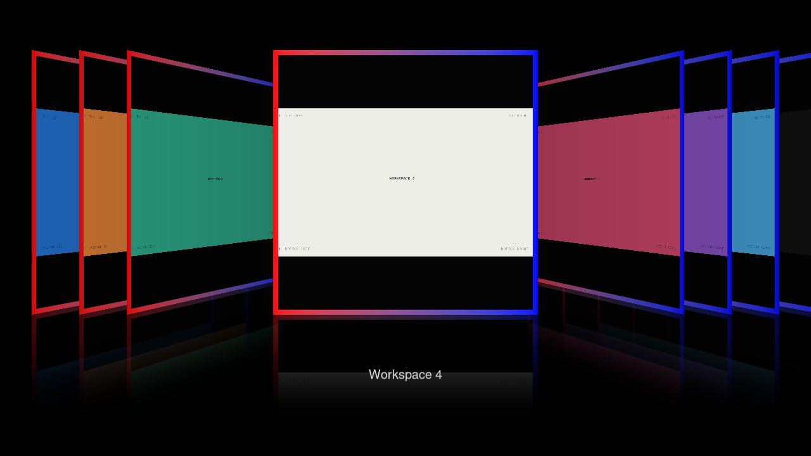

# Configuration & controls

The [default Lua configuration](https://github.com/sandwichfarm/hyprflow/blob/main/config/hyprflow.lua) defines independent actions and a modal `hyprflow` submap. Start with the [hyprpm installation and quick controls](getting-started.md#set-up-controls). The full configuration file waits until the plugin is loaded before applying settings and bindings; Hyprland rereads the configuration after loading a plugin.

## Workspace count

```lua
hl.config({ plugin = { hyprflow = { workspace_count = 9 } } })
```

`workspace_count` defaults to **9**, with an allowed range of **1–32**. Numeric cards do not create real workspaces until accepted. Existing workspaces on the focused monitor, including named workspaces, are also included. Workspaces on other monitors and special workspaces are excluded from navigation; an active special overlay is included in the original card.

## Default bindings

| Binding | Action |
| --- | --- |
| Super + Tab | Open; toggle reverses entry or closing |
| Super + Alt + Left / Right | Open and move selection |
| Super + Alt + 1–9 | Open and jump to a workspace |
| Left / Right while open | Move selection |
| 1–9 while open | Animate to that workspace |
| Return | Expand and activate selection |
| Escape | Return to original workspace |

Selection is separate from activation. Jumps travel through intermediate covers and leave the flow open. Invalid targets return an error, and navigation clamps at the ends.

## Lua actions and dispatchers

| Lua action | Dispatcher | Effect |
| --- | --- | --- |
| `hl.plugin.hyprflow.toggle()` | `hyprflow:toggle` | Open or reverse the transition |
| `hl.plugin.hyprflow.left()` | `hyprflow:left` | Move one card left |
| `hl.plugin.hyprflow.right()` | `hyprflow:right` | Move one card right |
| `hl.plugin.hyprflow.jump(id_or_name)` | `hyprflow:jump` | Select a numeric or named workspace |
| `hl.plugin.hyprflow.accept()` | `hyprflow:accept` | Activate the selection |
| `hl.plugin.hyprflow.cancel()` | `hyprflow:cancel` | Return to the original workspace |

For example:

```sh
hyprctl dispatch hyprflow:toggle
hyprctl dispatch hyprflow:jump 4
hyprctl eval 'hl.plugin.hyprflow.left()'
hyprctl repl 'return hl.plugin.hyprflow.status()'
```

## Custom bindings

```lua
hl.bind("SUPER + F", function() hl.plugin.hyprflow.toggle() end)
hl.bind("SUPER + ALT + Right", function()
    hl.plugin.hyprflow.right()
end, { repeating = true })
```

Keep the default modal submap when adding bindings. Its `catchall` consumes unrelated keys, including keys that could otherwise reach an input method. The previous submap and client focus are restored on exit.

## Flow appearance

These options belong under `plugin.hyprflow` in Lua configuration. They update
an open flow on its next rendered frame. Cards use the native workspace aspect ratio; wide and portrait workspaces have
no matte padding. These defaults replace the original square-cover geometry.

```lua
hl.config({ plugin = { hyprflow = {
    workspace_scale = 0.9,
    workspace_spread = 0.25,
    workspace_overlay = 1,
    background_color = "rgba(101827dd)",
    background_opacity = 0.45,
    background_blur = 16,
    reflection_opacity = 0.2,
    center_y = 0.45,
    show_labels = 1,
    border_width = 3,
    border_color = "rgba(ffffff55)",
    border_color_current = "rgba(33ccffee) rgba(00ff99ee) 45deg",
    border_color_focus = "rgba(ffdd44ff) rgba(ff66aaff) rgba(6688ffff) 90deg",
} } })
```

The [default configuration](../config/hyprflow.lua) contains the complete default
values and assignable keys. The existing `workspace_count` option is unchanged.

### Size and spacing

`workspace_scale` multiplies the card width,
`min(0.58 × monitor height, 0.38 × monitor width)`. Card height is that width
multiplied by `monitor height / monitor width`, including portrait monitors. Its default is `1.0`; the valid
range is `0.1` through `2.0`. Cards, reflections, and label
placement follow this size. Large values can extend cards beyond the viewport.
Entry and exit still begin/end at the full native desktop size.

`workspace_spread` sets the spacing between inactive card centers in units of
the configured card width, before perspective projection. The default is `0.18`, with a valid range of `0` to
`1`. Zero collapses the inactive stack; larger values spread it out. The nearest
cover stays at its original position, and the transition curve’s endpoint slope
changes with the spacing to preserve continuous travel. Perspective, yaw, and
spring timing are unchanged.

### Desktop overlay and background

| Setting | Default | Range / behavior |
| --- | --- | --- |
| `workspace_overlay` | `0` | `0`: solid stage; `1`: current workspace behind the cards |
| `background_color` | `rgb(000000)` | One color in the same hex formats as borders; no gradient |
| `background_opacity` | `1.0` | 0–1; multiplied by the color's alpha |
| `background_blur` | `0.0` | Gaussian kernel radius, 0–64 logical pixels; overlay only |
| `reflection_opacity` | `0.34` | 0–1; zero skips reflection draws |
| `center_y` | `0.4` | 0–1, vertical center as a fraction of monitor height |
| `show_labels` | `1` | `0`: hide captions; `1`: show captions |

Overlay uses a refreshed capture of the workspace where the switcher opened,
including its special overlay and pinned windows. Selecting another card keeps
that original desktop behind the stack until acceptance. It remains visible
while input is captured by the switcher's modal controls. The desktop tint and
blur fade in during entry and out during exit; the cards stay sharp. A blur of
zero bypasses the kernel. Blur prefilters a reduced-resolution desktop capture,
applies separate nine-tap horizontal and vertical Gaussian passes, and linearly
upsamples the result. The radius scales with monitor scale. Blur adds offscreen
render passes; software rendering can cost more GPU time.

On the solid stage, `background_color` blends over black using color alpha ×
`background_opacity`. With overlay enabled, the same tint blends over the desktop;
`background_opacity = 0` exposes the desktop, and `1` with an opaque color hides it.
Use numeric `0`/`1` for the two switches.

For example, a clear desktop with a compact stack and no reflection or caption:

```lua
hl.config({ plugin = { hyprflow = {
    workspace_overlay = 1, background_opacity = 0, background_blur = 0,
    workspace_scale = 0.8, workspace_spread = 0.3,
    reflection_opacity = 0, show_labels = 0, center_y = 0.5,
} } })
```

The [configuration video](../artifacts/appearance/configurations.mp4) shows the
solid stage, clear desktop overlay, and tinted blurred overlay with gradient
borders. See the [current appearance verification](verification.md#workspace-appearance-update).

### Borders

`border_width` is the inset stroke width in logical pixels, before the card’s
perspective projection. It accepts integers from `0` to `32`; zero, the default,
disables borders. The stroke follows the full workspace rectangle. It
foreshortens with the card, appears in its reflection, and fades out at the
full-desktop entry/exit endpoints. The label has no border.

The color options use Hyprexpo’s modern naming and documented hex forms:

- `rgb(RRGGBB)` is opaque RGB.
- `rgba(RRGGBBAA)` puts alpha last.
- `0xAARRGGBB` puts alpha first.
- One to ten whitespace-separated colors form equally spaced gradient stops.
  An optional final angle uses `deg`, for example `45deg`.

The native Hyprland gradient shader supplies Oklab color interpolation and its
angle convention: `0deg` runs left to right, `90deg` top to bottom. Angles are
normalized modulo 360 and rendered at whole-degree precision; for example,
`-45deg` becomes `315deg`, and `45.9deg` becomes `45deg`. Color prefixes are
lowercase; hex digits may use either case. Numeric/comma color functions and CSS
`#` colors are not accepted.

`border_color` defaults to opaque white. `border_color_current` and
`border_color_focus` default to empty strings:

1. A nonempty focused override wins on the selected destination.
2. Otherwise, a nonempty current override applies to the workspace where the
   flow began, including when it is also selected.
3. All other cases use the base color.

Set a role to transparent, such as `rgba(00000000)`, to suppress its border
instead of inheriting. Set it to an empty string to restore inheritance.

This follows [Hyprexpo’s modern color options and precedence](https://github.com/sandwichfarm/hyprexpo/blob/a54d20e433831eb9a5770e052c48736421ba7db5/src/OverviewRender.cpp#L648).
Its deprecated `border_style` and `border_grad_*` aliases are not introduced.
Gradient interpolation reuses the [matching Hyprland shader](https://github.com/hyprwm/Hyprland/blob/efb50993780079460b0cbed1363e2166a2de1d9f/src/render/shaders/glsl/gradient.glsl),
and color conversion uses the compositor’s parser and Oklab cache.

### Invalid settings and reloads

Out-of-range or nonfinite numeric appearance values, invalid switches/widths, malformed colors,
nonfinite angles, and more than ten stops are not applied. The previous valid
value remains effective. Hyprflow logs a rejection and posts a notification once
per changed invalid value. Restoring a valid value resets that suppression.

Hyprland 0.56.2’s Lua plugin path drops registered bounds and string validators.
Consequently, `hl.config()` can return success and `getoption` can show an invalid
raw value even though Hyprflow rejects applying it. Validation therefore also
runs at the plugin’s rendering boundary and after config-file reloads; it does
not depend on host validation or mutate the host’s config registry. See the
[upstream conversion path](https://github.com/hyprwm/Hyprland/blob/efb50993780079460b0cbed1363e2166a2de1d9f/src/config/lua/types/LuaConfigUtils.cpp).

### Tests

The current appearance proof checks monitor aspect, overlay origin, tint and
opacity pixels, background blur with sharp cards, reflections, captions, vertical
placement, invalid settings, borders, reloads, and accept/cancel cleanup. Start
with the seven calibration fixtures and the exact loaded plugin:

```sh
python3 scripts/verify-appearance.py "$session_dir" /tmp/hyprflow-appearance \
    --artifact "$PWD/build/hyprflow.so" \
    --sha256 "$(sha256sum build/hyprflow.so | cut -d' ' -f1)" --video
python3 scripts/caption-appearance-video.py /tmp/hyprflow-appearance
```

The script replaces only the owned session's test fixtures for the detailed blur
check and video. `manifest.json` records each scene's complete configuration and
timing; `configurations-raw.mp4` is the compositor recording. The published demo
adds preset captions using Pillow and FFmpeg. Capture preserves variable frame
timestamps; the caption tool rejects a recording whose duration does not match
the preset timeline. The earlier baseline/candidate border proof is retained
for historical comparisons; its square-default equality assertion is superseded
by the native-aspect assertion above.


`make check format-check` covers the build, pure geometry tests, Python syntax,
Cppcheck, and formatting. The geometry suite checks original defaults, resizing,
custom spread, symmetry, ordering, perspective preservation, and continuity at
the center/stack transition.

`scripts/verify-configuration.py` compares a baseline and candidate loaded
sequentially in the same owned nested session. It uses actual compositor pixels
to check default equivalence, size, spacing, border width, alpha, gradients,
angles, state precedence, and last-valid behavior. It also exercises config
reload and plugin unload/reload. Run its `--help` for exact phase arguments.
It uses the existing nested-session helpers, `grim`, and the already-installed
Pillow test tooling; there are no new plugin dependencies.

### Historical border verification

The [proof summary](../artifacts/configuration/verified/summary.json) records the
tested artifact and exact-build mapping checks. Before the workspace-aspect update, five complete default PNGs were
byte-identical to the original plugin in the same nested compositor. Customized
size, spacing, 2/8-pixel borders, alpha, state precedence, three/ten-color
gradients, and angle normalization pass actual pixel assertions.

The suite also covers 26 invalid-value cases, deduplicated diagnostics, invalid
file reloads while closed, the shipped Lua example, custom reloads, keyboard
isolation, and ten plugin unload/reload cycles. Both compositor and fixture
processes were stopped, with the owned host window restored. Raw failed attempts
remain in a private local archive; the published proof set includes passing
receipts without host paths or memory addresses.



These solid calibration workspaces make border geometry and colors measurable.
The lifecycle test now compares state before and after retargeting inside one
Lua callback. Separate IPC observations could straddle a normal render tick and
misidentify spring progression as a discontinuity.

Runtime qualification remains Hyprland 0.56.2/OpenGL at scale 1. Other compositor
ABIs, HDR, rotated/fractionally scaled outputs, and interactions with other
plugins were not added to the qualification scope by this change.
